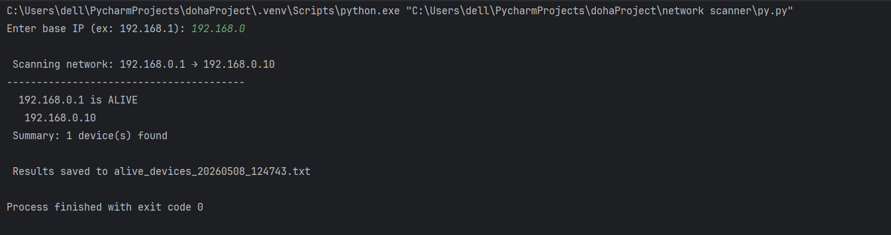

#  Network Scanner — Python

A Python tool that scans a local network to detect active devices using ping.

## Demo


## Features
- Detects active hosts via ping
- Compatible Windows & Linux
- Saves results to a timestamped .txt file

## Technologies
Python · OS · Platform

## How to run
```bash
python network_scanner.py
```
